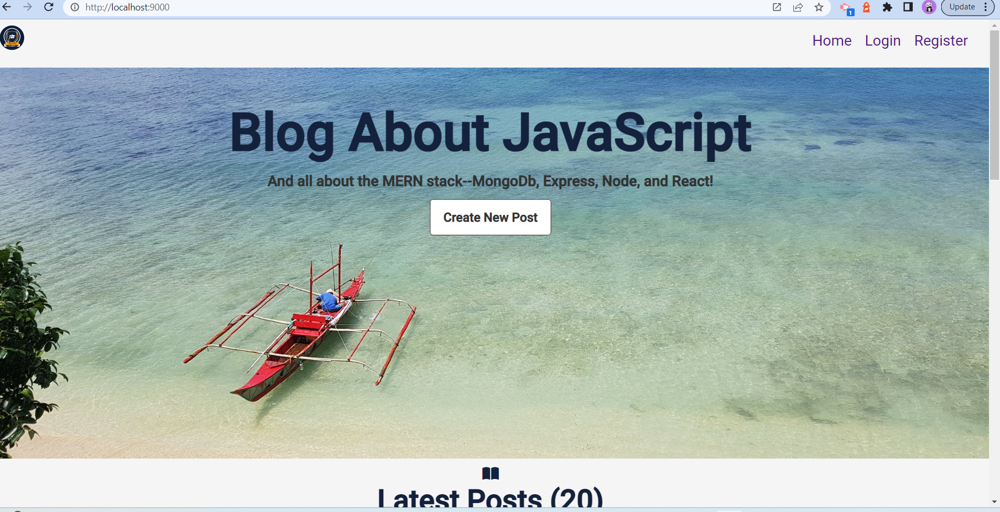
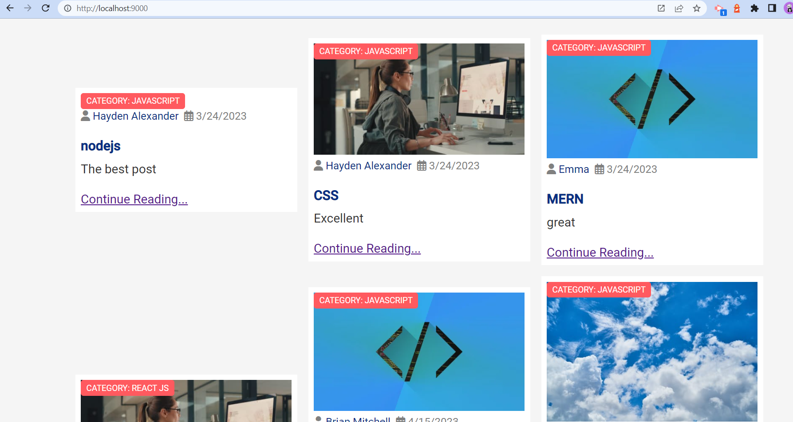
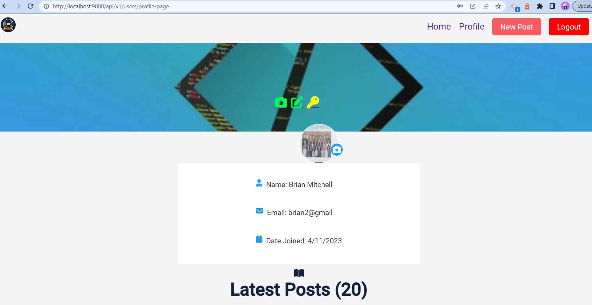
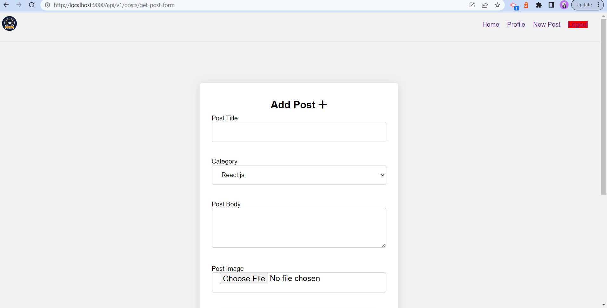
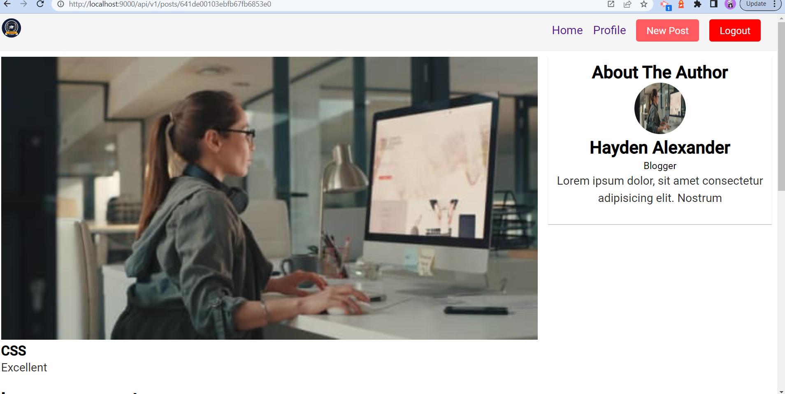
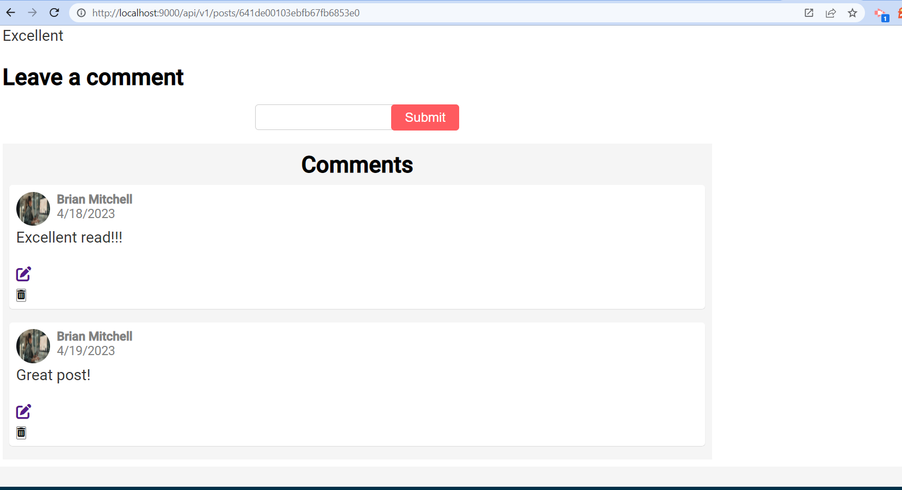

# BlogStack
# Description
Full-stack tech blog site built with HTML, CSS, JavaScript, MongoDb, Express.js, Node.js, and EJS template engine. Follows MVC architecture. Users can register and login, and upload photos for each blog posted as well as profile photos. Users can create, edit and delete their posts, and create, edit and delete comments on other blog posts.

## Installation
The necessary dependencies to install are:

Node.js
Express.js
Bcrypt
Cloudinary
EJS
Multer

## Usage
To run locally, install above dependencies and run 'npm i' in the terminal
To start: npm run server
To view: http://localhost/9000

### Github Repo
https://github.com/KarenAdkins84/BlogStack

### Credits
This was built with Udemy online learning and Inovotek Academy online!

### Screenshots

